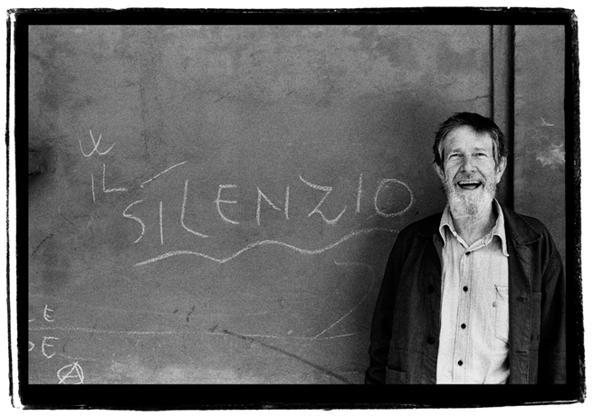

# ΜΕΛΕΤΗ ΓΙΑ ΤΗΝ ΤΕΧΝΗ ΗΧΟΥ
Ξαγοράρη Μαργαρίτα - ADA2019010

### ΕΙΣΑΓΩΓΗ

Η παρούσα μελέτη αναπτύσσεται στο πλαίσιο αποπεράτωσης εργασίας για το μάθημα Διαδραστικός Ηχητικός Σχεδιασμός. Βάση για την ανάπτυξη των μερών της εργασίας, αποτελεί η διάλεξη του καθηγητή Christoph Cox, με θέμα A Brief History of Sound Art - που έλαβε χώρα στις 18 Ιανουαρίου 2017, για το Barnes Foundation. 	
	
Σε πρώτο στάδιο θα αποδοθεί η απομαγνητοφώνηση και μετάφραση του αποσπάσματος 1:23:40 - 1:31:40, όπως έχει οριστεί σε σχετικό πίνακα. Σε δεύτερο στάδιο θα λάβει χώρα σχολιασμός - με εστίαση σε πέντε καλλιτέχνες περί των οποίων γίνεται αναφορά από τον Cox. Τέλος, με αφορμή ένα σημείο από την ομιλία, θα αποτυπωθούν σκέψεις και προθέσεις για μελλοντικό πειραματισμό.

### ΜΕΡΟΣ 1ο 
#### Α. ΜΕΤΑΓΡΑΦΗ ΑΠΟΣΠΑΣΜΑΤΟΣ  (1:23:40 - 1:31:40)

Amazing film, filmed with GoPro cameras largely, attached to the fishermen’s arms and heads and whatever. So, it is a very, kind of, visually disorienting film, but it is I think the sound that helps to take that image, which is always flat and right there in-front of you... and really kind of makes that image envelop you. And I will show the trailer, this is the commercial trailer for it… there it is. And the trailer is just a clip from the film, it’s a particular clip from the film, but I really 
encourage you to see it. One of the reasons why… the sound design is done by Ernst Karel, who is a fantastic sound artist , 
a guy who does field recording and presents his work in various kind of more sound art context. But he is the manager for 
the Sensory Ethnography Lab and also the guy who does all their sound... and really the film is so extraordinary sonically and 
really an example of film as a kind of sonic art. So here is the trailer.

(Video)

https://youtu.be/hh_5_CAySXY?t=5092

O.K. So, I know I’ve gone a little longer than I’ve hoped, than I’ve expected, but I’m happy to answer any questions, 
or take comments. Whatever. Thank you very much. Questions… Comments…

(From the audience)

Do you think we are maybe, culturally, in the midst of a change, from taking what we often dispersally just dump into a general category of noise and learning to understand that, in multitudinous ways, that help as to understand maybe our place in the world, or what the world has to offer?

(Cox)

Yes, it’s a good question. I mean of-course, I think really over… I was gonna say it is over the history of the twentieth 
century, but it is possibly the history of any century in a certain sense, that is attentive to noise in various ways, but
we’ve made it a cultural artefact and aesthetic entity, that maybe other centuries haven’t. And yes, the question of the shift,why the shift, and why are we
doing in the late 20th and early 21st century, what we see someone like Russolo short of inviting as to do in the beginning of the 20th. What are these kind of
cultural moments? I don’t know that I am enough of a 
historian to be able to sort out all of the kind of reasons for that, but yes… there has been a cultural shift, I think, 
in a significant way.

(From the audience)

Thank you, that was great. I actually just was into a podcast about how we kind of (no sound), and I’m curious if you think 
kind of (no sound) is our way of tapping back into that sense, through sound art and thought (no sound) , obvious use of sound 
or is it just (no sound) how can we (no sound)

(Cox)

Before that talk today, I was talking about the different ways we approach sound and image, right? So… I guess  I was saying  
this isn’t something kind of unique to me.

#### Β. ΜΕΤΑΦΡΑΣΗ ΑΠΟΣΠΑΣΜΑΤΟΣ

Υπέροχο φιλμ, κινηματογραφημένο με κάμερες GoPro, κυρίως, που τοποθετήθηκαν στα χέρια και στα κεφάλια των ψαράδων. Οπότε είναι,
κατά βάση, ένα φιλμ που αποπροσανατολίζει οπτικά, αλλά είναι νομίζω ο ήχος που βοηθάει να προσλάβεις αυτήν την εικόνα, που 
είναι πάντοτε επίπεδη και ακριβώς εκεί μπροστά σου. Kαι στ’ αλήθεια, κατά κάποιο τρόπο, κάνει αυτή την εικόνα να σε περικλείει.
Θα δείξω το τρέιλερ. Aυτό είναι το διαφημιστικό του τρέιλερ… Eίναι ένα συγκεκριμένο απόσπασμα από το φιλμ, αλλά πραγματικά σας 
ενθαρρύνω να το δείτε. Ένας από τους λόγους, είναι ότι η ηχητική επένδυση έχει γίνει από τον Ernst Karel, που είναι ένας 
εξαιρετικός καλλιτέχνης του ήχου, ένας τύπος που κάνει ηχογραφήσεις πεδίου και παρουσιάζει το έργο του σε διαφορετικά είδη 
περιεχομένου ηχητικής τέχνης, αλλά είναι και ο διευθυντής του Sensory Ethnography Lab και επίσης ο άνθρωπος που κάνει όλους 
τους ήχους τους. Στ’ αλήθεια,το φιλμ είναι τόσο εξωπραγματικό ηχητικά… και είναι πραγματικά ένα παράδειγμα ενός φιλμ που 
εντάσσεται στο είδος της ηχητικής τέχνης. Οπότε, εδώ είναι το τρέιλερ.

(Βίντεο)

https://youtu.be/hh_5_CAySXY?t=5092

Εντάξει. Λοιπόν, ξέρω ότι έχω υπερβεί χρονικά - σε σχέση με αυτό που περίμενα, αλλά μετά χαράς θα απαντήσω σε ερωτήσεις και θα 
δεχθώ σχόλια. Σας ευχαριστώ πολύ.

(Από το κοινό)

Πιστεύετε ότι ίσως βρισκόμαστε πολιτισμικά στο μέσον μιας αλλαγής - του ότι παίρνουμε αυτό που συχνά απλά πετάμε μέσα σε μια 
γενική κατηγορία θορύβου και αρχίζουμε να το καταλαβαίνουμε με ποικίλους τρόπους, που μας βοηθούν να κατανοήσουμε, ίσως, τη 
θέση μας στον κόσμο ή τι έχει να προσφέρει ο κόσμος;

(Cox)

Ναι, καλή ερώτηση. Δηλαδή, οπωσδήποτε πιστεύω πως αφορά… πήγαινα να πω πως αφορά στην ιστορία του 20ου αιώνα, αλλά είναι 
πιθανότατα η ιστορία κάθε αιώνα - κατά μία έννοια, που είναι προσανατολισμένη στο θόρυβο με διάφορους τρόπους. Αλλά εμείς το 
κάναμε πολιτισμικό τεχνούργημα και αισθητική οντότητα που ίσως σε άλλους αιώνες δεν συνέβη. Και ναι, η ερώτηση της αλλαγής… 
γιατί η αλλαγή; Kαι γιατί κάνουμε στα τέλη του 20ου και στις αρχές του 21ου αιώνα, αυτό που βλέπουμε να κάνει κάποιος σαν τον 
Russolo - και που μας προσκαλει κατά μία έννοια να κάνουμε, στις αρχές του 20ου αιώνα. Δεν νομίζω ότι έχω επαρκείς ιστορικές 
γνώσεις ώστε να μπορώ να ξεδιαλύνω όλες τις πιθανές αιτίες γι΄ αυτό, αλλά ναι… μια πολιτισμική αλλαγή έχει λάβει χώρα, νομίζω 
με έναν αξιόλογο τρόπο.

(Από το κοινό) 

Σας ευχαριστούμε, ήταν εξαιρετικό. Βασικά πρόσφατα ήμουν σε μία διαδικτυακή ραδιοφωνική μετάδοση, σχετικά με το πως (ο ήχος 
κόβεται ανά διαστήματα - δεν βγαίνει νόημα).

(Cox)

Πριν τη σημερινή ομιλία, μιλούσα για τους διαφορετικούς τρόπους που προσεγγίζουμε τον ήχο και την εικόνα, οπότε έλεγα ότι αυτό 
δεν είναι κάτι ιδιαίτερα πρωτόγνωρο για μένα.

### ΜΕΡΟΣ 2ο 

#### ΕΙΣΑΓΩΓIKΗ ΤΟΠΟΘΕΤΗΣΗ ΣΕ ΣΧΕΣΗ ΜΕ ΤΟ ΣΥΝΟΛΟ ΤΗΣ ΔΙΑΛΕΞΗΣ

Η ομιλία του Cox με τίτλο A Brief History of Sound Art, υπήρξε ιδιαίτερα διαφωτιστική -κυρίως επειδή με βοήθησε να θέσω σε μια σειρά, συγκεχυμένες μέχρι πρότινος πληροφορίες - που αφορούσαν στην πορεία και εξέλιξη των δεδομένων στο πεδίο της Τέχνης Ήχου (που όπως λέει και ο Cox, είναι μια πολύ αδρή ετικέτα, που χρησιμοποιείται για να περιγράψει ένα μεγάλο σύνολο καλλιτεχνικής δραστηριότητας). 

Προκειμένου για την ανάπτυξη σχολιασμού, επέλεξα να εστιάσω σε πέντε καλλιτέχνες, με κριτήριο το αποτύπωμα που μου άφησαν με το πέρας της ομιλίας (σε επίπεδο ανάπτυξης περαιτέρω σκέψης). 

Οι καλλιτέχνες αυτοί είναι οι Luigi Russolo, John Cage, Alvin Lucier, Christina Kubisch και Ernst Karel.

#### ΠΡΟ ΤΗΣ ΑΝΑΠΤΥΞΗΣ ΣΧΟΛΙΑΣΜΟΥ

Πριν την ανάπτυξη των πέντε σχολίων, κρίνεται σκόπιμη μια συνοπτική παρουσίαση των εν λόγω καλλιτεχνών.

#### Luigi Russolo (1885-1947) 

 Ιταλός ζωγράφος, συνθέτης, κατασκευαστής μουσικών οργάνων και βασικό μέλος του φουτουριστικού κινήματος από τις απαρχές της δημιουργίας του. Ο Russolo, αντιπροσωπεύει μια κρίσιμη στιγμή για την εξέλιξη της μουσικής αισθητικής του 20ου αιώνα. Θεωρείται ο πατέρας της πρώτης συστηματικής ποιητικής των θορύβων και από κάποιους, ακόμα και ο δημιουργός του συνθεσάιζερ. (Chessa, 2012, σ.3)
  
  Το 1913, σε γράμμα προς τον φίλο του φουτουριστή συνθέτη Francesco Balilla Pratella (Russolo, 1986, σ. 23), θα διατυπώσει τις θέσεις του για τη μουσική - με το φουτουριστικό μανιφέστο The Art of Noises, όπου θα επισημάνει την ανάγκη αξιοποίησης των απεριόριστων δυνατοτήτων των θορύβων (Russolo, 1986, σ. 25). Έκτοτε θα στραφεί στην κατασκευή οργάνων - των intonarumori (noise intoners), για να εμβαθύνει πρακτικά σε αυτές τις θέσεις. Το 1921 θα προβεί στην κατασκευή ενός άλλου οργάνου, του rumorarmonio (noise harmonium). (Chessa, 2012, σ. 4)
  
   
     <b> Εικ. 1 Russolo's intonarumori </b>

#### John Cage (1912 - 1992)

Αμερικανός συνθέτης, θεωρητικός της μουσικής, εικαστικός καλλιτέχνης, ποιητής  και φιλόσοφος. Ο Cage είναι ευρύτερα γνωστός για την επανάσταση που έφερε στη μουσική μέσω της μη συμβατικής χρήσης μουσικών οργάνων αλλά και λόγω της ιδέας της μουσικής περιβάλλοντος - που συμβαίνει τυχαία. Η προσέγγιση του ως προς τη σύνθεση, ήταν βαθιά επηρεασμένη από ασιατικές φιλοσοφίες - εστιάζοντας στην αρμονία που υπάρχει στη φύση και στα στοιχεία της τυχαιότητας. 		
     
Ο Κέιτζ δεν είναι γνωστός μόνο για τα ριζοσπαστικά έργα του, όπως το 4΄33΄΄(1952), αλλά επίσης για τις καινοτόμες συνεργασίες του με καλλιτέχνες όπως ο Merce Cunningham και ο Robert Rauschenberg. Αυτές οι συνεργασίες βοήθησαν στο να σπάσουν τα όρια μεταξύ των διαφορετικών τομέων τέχνης - μουσική, περφόρμανς, ζωγραφική, χορός κ.λπ.  - οδηγώντας στην παραγωγή νέων, διεπιστημονικών έργων. (John Cage, 2020, παρ. 1)

     <b> Εικ. 2 John Cage </b>

#### Alvin Lucier (1931-)
	
Αμερικανός συνθέτης πειραματικής μουσικής και καλλιτέχνης ηχητικών εγκαταστάσεων, που διερευνά τα ακουστικά φαινόμενα και την ηχητική πρόσληψη. Διετέλεσε καθηγητής μουσικής στο Wesleyan University, ενώ αποτέλεσε ιδρυτικό μέλος του Sonic Arts Union - μαζί με τους Robert Ashley, David Behrman και Gordon Mumma. Μεγάλο μέρος της δουλειάς του, είναι επηρεασμένο από την επιστήμη και τις φυσικές ιδιότητες του ήχου : την αντήχηση των χώρων, την παρεμβολή φάσης ανάμεσα σε κοντινές συχνότητες και τη μετάδοση του ήχου μέσα από υλικά μέσα. (Alvin Lucier, 2020, παρ.1)

     <b> Εικ. 3 Alvin Lucier, I'm Sitting in a Room  </b>

#### Christina Kubisch 
	
Γεννημένη στη Βρέμη το 1948, σπούδασε ζωγραφική, σύνθεση και ηλεκτρονική μουσική στο Αμβούργο, στο Γκρατς, στη Ζυρίχη και στο Μιλάνο. Η Kubisch ανήκει στην πρώτη γενιά καλλιτεχνών του ήχου. Έχει αναπτύξει πολλαπλές καλλιτεχνικές τεχνικές βασισμένες στην ηλεκτρομαγνητική επαγωγή, την ηλιακή ενέργεια και τα ειδικά συστήματα φωτισμού. 

Υπήρξε καθηγήτρια Οπτικοακουστικών Τεχνών στο Βερολίνο, στο Παρίσι, στο Σααρμπρύκεν και στην Οξφόρδη και είναι μέλος της Ακαδημίας Τεχνών του Βερολίνου. Οι εγκαταστάσεις, οι συνθέσεις και τα οπτικοακουστικά έργα της έχουν παρουσιαστεί σε όλον τον κόσμο.

Από το 2003, έχει ξεκινήσει τη σειρά Electrical Walks, όπου το κοινό μπορεί να ακούσει - μέσα από ειδικής κατασκευής ακουστικά, τα κρυμμένα ηλεκτρομαγνητικά κύματα των πόλεων. (Electrical Walks, 2020)

     <b> Εικ. 4 Electrical Walks  </b>

#### Ernst Karel

Καλλιτέχνης του ήχου με εστίαση στην ηλεκτροακουστική μουσική, στα πειραματικά ηχητικά έργα για πολυκαναλικές εγκαταστάσεις και περφόρμανς και στη δημιουργία ήχου για το στάδιο της μεταπαραγωγής σε ταινίες - με έμφαση στο σινεμά της παρατήρησης. 

Τα πρόσφατα ατομικά πρότζεκτ του, βασίζονται σε ανεπεξέργαστα location recordings και έχουν παρουσιαστεί στο Sonic Acts στο Άμστερνταμ, στο Oboro στο Μόντρεαλ, στο EMPAK στη Νέα Υόρκη, στο Arsenal στο Βερολίνο και το 2014 στη Whitney Biennial. 

Έχει πραγματοποιήσει συνεργασίες με καλλιτέχνες όπως η Helen Mirra - για ηχητικές εγκαταστάσεις που έχουν παρουσιαστεί στο Gardner Museum στη Βοστώνη, στο Culturgest στη Λισαβόνα, στο KW Institute for Contemporary Art στο Βερολίνο, στο Audiorama στη Στοκχόλμη, στο MIT List Visual Arts Center στο Κέμπριτζ και το 2012 στη Μπιενχαλε του Σάο Πάολο.

Επίσης, έχει πραγματοποιήσει συνεργασίες με τους Veronica Kusumariati,  Lucien Castaing-Taylor και Véréna Paravel, Toby Lee και Pawel Wojtasik.

Από το 2006 μέχρι το 2017 ανέλαβε τη διεύθυνση στο Sensory Ethnography Lab στο Πανεπιστήμιο του Χάρβαρντ, κάνοντας ήχο μεταπαραγωγής για φιλμ  - μεταξύ των οποίων τα The Iron Ministry, Manakamana και Leviathan. (Ernst Karel, 2020)

     <b> Εικ. 5 Ο E.Karel κατά την ηχογράφηση του Heard Laboratories στο Πανεπιστήμιο του Χάρβαρντ  </b>

### Α. ΠΕΝΤΕ ΣΧΟΛΙΑ ΠΑΝΩ ΣΤΗΝ ΟΜΙΛΙΑ ΤΟΥ C.COX
	
#### Σχόλιο 1ο
#### Russolo - Οι απεριόριστες δυνατότητες των θορύβων

Το πρώτο ζήτημα στο οποίο θα ήθελα να εστιάσω, αφορά στη συμβολή του Luigi Russolo στα της Τέχνης του Ήχου. Για να είμαι ειλικρινής, γνώριζα του Russolo, μόνο ως φουτουριστή ζωγράφο. Αυτή η νέα διάσταση που έλαβα για τη συγκεκριμένη καλλιτεχνική προσωπικότητα, μου γέννησε την επιθυμία να λάβω περαιτέρω πληροφόρηση. 

Έτσι, οδηγήθηκα στην ανάγνωση του φουτουριστικού μανιφέστου του Russolo, The Art of Noises, το οποίο παρουσιάζει αποσπασματικά και ο Cox (11:11-12:25) στην ομιλία του.

Αναντίρρητα, ο Russolo υπήρξε εξαιρετικά πρωτοπόρος. 

Το όραμα του, ωστόσο, άρχισε να μεταδίδεται ευρύτερα - μετά την εμπορική διάθεση των μέσων καταγραφής ήχου (tape recorders). Οι καλλιτεχνικές πρακτικές καλλιτεχνών όπως ο Halim El-Dabh και ο Pierre Schaeffer (Cox, 17:00-21:40), δεν μπορεί να μην ειδωθούν σε συσχετισμό με το όραμα του Russolo. Και φυσικά, δεν μπορούμε να παραγνωρίσουμε πως και μέχρι και σήμερα, το όραμα του Russolo παραμένει ζωντανό.

Και μιας και έγινε αναγωγή στο σήμερα, θα ήθελα να κάνω λόγο - κλείνοντας, για μια ομιλία στο TED που παρακολούθησα πριν από κάποιους μήνες, από τον δικηγόρο και μουσικό Damien Riehl, με τίτλο Copyrighting all the Μelodies to Αvoid Αccidental Ιnfringement  - και η οποία ανακλήθηκε συνειρμικά, με την ανάγνωση του Art of Noises.			

Ουσιαστικά, ο Riehl υποστηρίζει πως η μουσική είναι απλά μαθηματικά και πως υπάρχει ένας πεπερασμένος αριθμός δυνατών συνδυασμών. Λόγω αυτού, υποστηρίζει πως είναι πολύ πιθανή η επανάληψη των μελωδιών - χωρίς να υπάρχει εσκεμμένη αντιγραφή. Ο ίδιος, εν συνεχεία, δηλώνει, πως με την αρωγή του φίλου του και προγραμματιστή Noah Rubin, παρήγαγε όλους τους δυνατούς συνδυασμούς μελωδιών - με την αξιοποίηση του κατάλληλου αλγορίθμου. Η πρόθεση του, ως προς τις εν λόγω, κατοχυρωμένες πλέον, μελωδίες, είναι να διατίθενται υπό τη συνθήκη του public domain, ελεύθερα προς κάθε δημιουργό, γιατί όπως λέει…δεν θα αργούσε η στιγμή που θα στερεύαμε από μελωδίες (Riehl, 9:25 - 10:30). 

Η προσέγγιση του Riehl, είναι λίγο υπερβολική, (προφανώς και δεν παρήγαγε όλους τους δυνατούς συνδυασμούς, καθώς βασίστηκε σε ένα συγκεκριμένο εύρος από νότες), είναι όμως εξαιρετικά ενδιαφέρουσα καθώς εστιάζει σε ένα ρεαλιστικό προβληματισμό, που αφορά σε αυτό που ήδη από το 1913 είχε εκφράσει ο Russolo - αναφερόμενος στον περιορισμένο κύκλο των μουσικών ήχων. 

	

#### Σχόλιο 2ο 
#### John Cage - Οι απεριόριστες δυνατότητες της σιωπής

Το επόμενο σημείο από την ομιλία, στο οποίο θα ήθελα να εστιάσω, αφορά στον John Cage και στο κομμάτι 4΄33΄΄, όχι για να επισημάνω τη σημασία του έργου, που αναντίρρητα είναι μεγάλη - αλλά για να αναφερθώ σε μια πολύ ενδιαφέρουσα αντίφαση που διαπίστωσα μέσα από την ομιλία του Cox. 

Έχοντας ήδη στο μυαλό μου την προσέγγιση του Russolo - περί των απεριόριστων δυνατοτήτων των θορύβων, η αναφορά εν συνεχεία στον Cage και στο έργο του 4΄33΄΄ (Cox, 21:50), φάντασε να στέκει οξύμωρα σε αυτό το ξεδίπλωμα που έκανε ο Cox. 

Θόρυβος και σιωπή… 

Και όμως και οι δύο αποσκοπούσαν στο ίδιο πράγμα… στην αναίρεση των περιορισμών… ο ένας μέσα από τις απεριόριστες δυνατότητες των θορύβων και ο άλλος μέσα από τις απεριόριστες δυνατότητες της σιωπής (που ουσιαστικά, όπως έλεγε και ο ίδιος, δεν υφίστατο). 

Ο Cage, άσκησε μεγάλη επιρροή σε καλλιτέχνες του Ήχου, οι οποίοι αποπειράθηκαν να πειραματιστούν με την ιδέα της μετατόπισης του ακουστικού ενδιαφέροντος. Χαρακτηριστικά παραδείγματα, ο Max Neuhaus και ο Akio Suzuki, οι οποίοι θα δημιουργήσουν δύο παραπλήσιας λογικής έργα, το Listen (Cox, 26:14-27:00) και το Listen Point (Cox, 1:07:40 - 1:08:40) αντίστοιχα, μέσα από τα οποία θα καλέσουν το κοινό να εστιάσει στoυς ήχους-θορύβους του χώρου. Στην περίπτωση του Cage του συναυλιακού χώρου, χωρίς άμεση παρακίνηση, και στην περίπτωση των Neuhaus και Suzuki, του εξωτερικού χώρου  - μέσα από τo λεγόμενo sound walking.

  

#### Σχόλιο 3ο
#### Alvin Lucier - Η σχέση ήχου και αρχιτεκτονικής
	
Καθώς εξελίσσεται η ομιλία του Cox, αντιλαμβάνεται κανείς μια πορεία προοδευτικής ένταξης του ήχου, σε νέα πλαίσια καλλιτεχνικής δράσης - μέσα από πειραματισμούς και προσεγγίσεις πρωτοπόρων καλλιτεχνών, μεταξύ των οποίων και ο Alvin Lucier.

O λόγος που αναφέρομαι στον εν λόγω καλλιτέχνη, είναι για να επισημάνω την αξία σύνδεσης του ήχου με το χώρο και την αρχιτεκτονική, έτσι όπως τη διατυπώνει και ο ίδιος μέσα από την ακόλουθη φράση  “Ξεκίνησα να σκέφτομαι τους ήχους με όρους μικρού και μεγάλου πλάτους κυματομορφών (…).Το να σκέφτομαι τους ήχους ως μετρήσιμα πλάτη κυματομορφών άλλαξε όλη την ιδέα μου για τη μουσική - από μια μεταφορά σε ένα γεγονός και, με έναν πραγματικό τρόπο, με συνέδεσε με την αρχιτεκτονική” (Cox, 47:00-47:20).

Μέσα από τα λόγια του Lucier, μπορούμε να διαπιστώσουμε την πρόθεση του να προσεγγίσει τον ήχο ως υπόσταση - μέσα στο χώρο και σε σχέση με το χώρο. Χαρακτηριστικό παράδειγμα, το έργο I’m Sitting in a Room (Cox, 41:55- 46:20), όπου ο Lucier ηχογραφεί τον εαυτό του κατά την αφήγηση ενός κειμένου και έπειτα αναπαράγει σε ένα δωμάτιο την ηχογράφηση - επανηχογραφώντας την. Το ηχητικό απόσπασμα ακούγεται επαναλαμβανόμενα, ποτέ όμως το ίδιο, εφόσον κάθε φορά αναπαράγεται η τελευταία ηχογραφημένη εκδοχή του στο χώρο. Η διαμόρφωση του ηχητικού  αποσπάσματος στα πλαίσια του συγκεκριμένου δωματίου, έχει ορισμένη εξέλιξη - εφόσον ορίζεται από τα χαρακτηριστικά του δωματίου, βάσει των οποίων παράγεται η αντήχηση. 

Η προσέγγιση του Lucier, με οδήγησε συνειρμικά και στα λόγια που διατύπωσε ο Neuhaus το 1990 “Το πιο σημαντικό είναι ότι στη μουσική ο ήχος είναι το έργο. Σε αυτό που κάνω, ο ήχος είναι το μέσο για να κάνω το έργο, για να μετατρέψω το χώρο σε τόπο” (Cox, 27:06).

#### Σχόλιο 4ο
#### Christina Kubisch - Η αποκάλυψη κρυμμένων κόσμων
	
Για τον τέταρτο σχολιασμό θα εστιάσω στο εξαιρετικού ενδιαφέροντος έργο της Γερμανίδας καλλιτέχνιδας Chrstina Kubish, Electrical Walks(Cox, 1:08:40-1:09:40). 	

Η Kubish, αξιοποίησε τα ηλεκτρομαγνητικά πεδία που αναπτύσσονταν σε σημεία της πόλης (ΑΤΜ, πύλες ελέγχου-ασφαλείας, κ.λπ.), προκειμένου - μέσω ενός σετ ακουστικών, να μετατρέψει σε ήχο τα ηλεκτρομαγνητικά κύματα και να ανάγει έτσι μια απλή  περιήγηση στην πόλη, σε μια πορεία ανακάλυψης ενός κρυμμένου κόσμου - θεωρώ, πιο ενδιαφέροντος.  

Το εν λόγω έργο μου θύμισε λίγο το αόρατο παιχνίδι της εικόνας με τον ήχο για το οποίο έκανε λόγο ο Cox, μέσα από τα έργα της Christian Marclay (photography-phonography) (Cox, 54:25 - 54:55). Η Marclay, ανιχνεύει τις δυνατότητες του ήχου μέσα από σιωπηλές εικόνες και αντικείμενα. Ο ήχος στα έργα της, δεν αναπαράγεται, παρά μόνο μπορεί να συμπληρωθεί νοερά από το θεατή - που αναγνωρίζει κάποιο συσχετισμό. Η Kubisch αντιστρέφει τους όρους... προσθέτει ήχο εκεί που δεν μπορεί καν να ανακληθεί ή να συμπληρωθεί νοερά, με την αξιοποίηση του κατάλληλου εξοπλισμού - εν είδει επαύξησης πραγματικότητας. 

Είναι σαν να αποκτάται πρόσβαση σε μια άλλη διάσταση - μέσω της οποίας συμπληρώνεται η πληροφορία του χώρου, με την αρωγή του μέσου (και εδώ βλέπουμε για μια ακόμη φορά, πόσο καταλυτικής σημασίας είναι η εξέλιξη και η αξιοποίηση της τεχνολογίας για την εκκίνηση νέων διαδρομών στην Τέχνη).

#### Σχόλιο 5ο 
#### Ernst Karel - Leviathan
	  
Το τελευταίο σχόλιο που θα πραγματοποιήσω, αφορά στο φιλμ Leviathan, την ηχητική επένδυση του οποίου έχει κάνει ο Ernst Karel, καλλιτέχνης του ήχου και διευθυντής του Sensory Ethnography Lab.

Όπως λέει και ο Cox, το συγκεκριμένο φιλμ αποτελεί αντιπροσωπευτικό δείγμα ενός φιλμ που εντάσσεται στο είδος της Ηχητικής Τέχνης.

Το σύντομο απόσπασμα που παρουσιάζει ο Cox (1:24:45- 1:28:55), το οποίο είναι και το τρέιλερ της ταινίας, αρκεί για να καταλάβει κανείς αυτό που αναφέρει πολύ χαρακτηριστικά ο ομιλητής, ότι ο ήχος δηλαδή έχει τόση δύναμη, που κάνει αυτή την επίπεδη εικόνα να νιώσεις ότι σε αγκαλιάζει(Cox, 1:23:50). Ο ήχος δεν συμπληρώνει απλά την εικόνα, τη ζωντανεύει με έναν τρόπο που σε βοηθάει να εμβυθιστείς και να παρασυρθείς σε αυτή τη δίνη της ανταριασμένης θάλασσας.

Με την παρακίνηση του Cox, θέλησα να παρακολουθήσω το σύνολο της ταινίας. 

Ανά διαστήματα απενεργοποιούσα τον ήχο, για να μπορέσω να αντιληφθώ τη βαρύτητα του στην αφήγηση. Η αίσθηση ήταν ασύγκριτα υποδεέστερη. Η πληροφορία από τον ήχο ήταν τόσο ισχυρή που θα μπορούσε να πει κανείς ότι θα είχε περισσότερο ενδιαφέρον να παρακολουθήσει την ταινία χωρίς εικόνα, παρά χωρίς ήχο.

Πράγματι, όπως λέει ο Cox, είναι ένα φιλμ, εξωπραγματικό ηχητικά.
  

### Β. ΠΡΟΘΕΣΕΙΣ ΓΙΑ ΜΕΛΛΟΝΤΙΚΟ ΠΕΙΡΑΜΑΤΙΣΜΟ

#### Ειδικότερη εστίαση στο έργο της Christina Kubish - Η ιδέα της πρόσβασης σε μια άλλη διάσταση δεδομένων

Το έργο της Christina Kubisch, είναι αυτό στο οποίο θα εστιάσω προκειμένου να εκφράσω τις προθέσεις μου για μελλοντικό πειραματισμό. 

Η ιδέα που με προσελκύει ως προς το συγκεκριμένο έργο, αφορά κυρίως στη δυνατότητα πρόσβασης σε μια άλλη διάσταση δεδομένων. Σε μια κρυφή πραγματικότητα, η οποία αποκαλύπτεται μέσω μιας περιήγησης. 

Η Kubish, αξιοποιώντας την ηλεκτρομαγνητική δραστηριότητα των σημείων δημιούργησε αυτήν την αίσθηση της πρόσβασης σε  έναν άλλο κόσμο - τον οποίο ο περιηγητής μέσω της διαδρομής του ανακαλύπτει (διαμορφώντας και ο ίδιος το βίωμα, εφόσον ορίζει τη διαδρομή). 
Μέσα από την επαφή με το έργο της, μου ανακινήθηκε η διερώτηση… πόσοι κρυμμένοι κόσμοι μας περιβάλλουν; Ο άνθρωπος είναι, αναντίρρητα, περιορισμένος, λόγω των αισθητήρων του. 

Σκέφτηκα πως θα είχε πολύ ενδιαφέρον μια περιήγηση σε έναν κόσμο που θα μπορούσαν να αποκαλυφθούν, για παράδειγμα, οι μη προσβάσιμες από το ανθρώπινο αυτί συχνότητες (π.χ. οι κάτω από 20Ηz). 
Σκέφτηκα επίσης, πως η κάθε διαδρομή είναι μοναδική και πως εφόσον τίποτα δεν βιώνεται ποτέ ξανά με τον ίδιο τρόπο - θα είχε ενδιαφέρον να καταγράφεται το ηχητικό αποτύπωμα της κάθε διαδρομής (ως απόρροια της συνέργειας χώρου, ήχου, περιηγητή).

### ΣΥΜΠΕΡΑΣΜΑΤΑ
Ο Cox, απέδωσε με τρόπο εύληπτο, αυτό που δηλώνεται από τον τίτλο ήδη, μια Σύντομη Ιστορία της Τέχνης Ήχου. H ομιλία του, αποτελεί μια καλή αφορμή για παραγωγικό προβληματισμό και σκέψη πάνω στη φύση και στο περιεχόμενο της Ηχητικής Τέχνης. Με την παρούσα μελέτη, έγινε μια πρώτη ανίχνευση των ζητημάτων που θέτει ο Cox - η οποία μπορεί να λειτουργήσει ως βάση για μελλοντική εμβάθυνση.

  
 ### ΒΙΒΛΙΟΓΡΑΦΙΑ

Chessa, L. (2012). _Luigi Russolo, Futurist: Noise, Visual Arts, and the Occult._ Berkeley: University of California Press.

Russolo, L. (1986). _The Art of Noises._ Translated by Barclay Brown. New York: Pendragon Press.

### ΔΙΚΤΥΑΚΟΙ ΤΟΠΟΙ

Alvin Lucier. Wikipedia. Wikimedia Foundation. Ημερομηνία επίσκεψης Ιούνιος 26, 2020.

https://en.wikipedia.org/wiki/Alvin_Lucier

Electrical Walks. Christina Kubisch. Ημερομηνία επίσκεψης Ιούνιος 25, 2020.

https://electricalwalks.org/about/

Ernst Karel - about. Ημερομηνία επίσκεψης Ιούνιος 26, 2020.

http://ek.klingt.org/bio.html

John Cage. The Art Story. Ημερομηνία επίσκεψης Ιούνιος 29, 2020.

https://www.theartstory.org/artist/cage-john/

### ΟΠΤΙΚΟΑΚΟΥΣΤΙΚΟ ΥΛΙΚΟ

Christoph Cox, History of Sound Art, Barnes Foundation. Ημερομηνία επίσκεψης Ιούνιος 20, 2020.

https://youtu.be/hh_5_CAySXY

Leviathan (2012), Player Unknown. Ημερομηνία επίσκεψης Ιούνιος 22, 2020.

https://www.youtube.com/watch?v=YP1eC55tW4w

Damien Riehl, Copyrighting all the melodies to avoid accidental infringement, TEDxMinneapolis - TEDx Talks. Ημερομηνία επίσκεψης Ιούνιος 25, 2020.

https://www.youtube.com/watch?v=sJtm0MoOgiU

John Cage's 4’33”, Joel Hochberg. Ημερομηνία επίσκεψης Ιούνιος 20, 2020.

https://www.youtube.com/watch?v=JTEFKFiXSx4&t=395s

Christina Kubisch, Electrical Walks, Goethe-Institute Russland. Ημερομηνία επίσκεψης Ιούνιος 29, 2020.

https://www.youtube.com/watch?v=5tCphr8pbFk

  
### ΠΗΓΕΣ ΕΙΚΟΝΩΝ

Εικ 1.

Alexander Lee, _The Art of Noises,_ Δεκέμβριος 12, 2017. Ημερομηνία επίσκεψης Ιούλιος 1, 2020.
http://www.medienkunstnetz.de/works/intonarumori/

Εικ 2.

Rossella Smiraglia, _Quattro minuti e 33 secondi 4’33”. Il suono del silenzio (Cage),_ September 2, 2017. Ημερομηνία επίσκεψης Ιούλιος 1, 2020.

https://www.wallofsoundgallery.com/en/john-cage-by-guido-harari-john-cage-C-bologna-C--i3066

Εικ 3.

Martha Joseph, _Collecting Alvin Lucier's I'm Sitting in a Room,_ January 20, 2015. Ημερομηνία επίσκεψης Ιούλιος 1, 2020.
https://www.moma.org/explore/inside_out/2015/01/20/collecting-alvin-luciers-i-am-sitting-in-a-room/

Εικ 4. 

John Roach, _Electrical Walks – Christina Kubisch (since 2004),_ Ιανουάριος 31, 2018. Ημερομηνία επίσκεψης Ιούλιος 1,2020.

http://www.spring2018.soundthemound.com/2018/01/31/electrical-walks-christina-kubisch-since-2004/

Εικ 5.

Marc Masters & Grayson Currin _The world of field recordings with Chris Watson, Ernst Karel, and Art Rosenbaum,_ Οκτώβρης 21, 2011. Ημερομηνία επίσκεψης Ιούλιος 1, 2020.

https://pitchfork.com/features/the-out-door/8692-field-recording/?page=3

